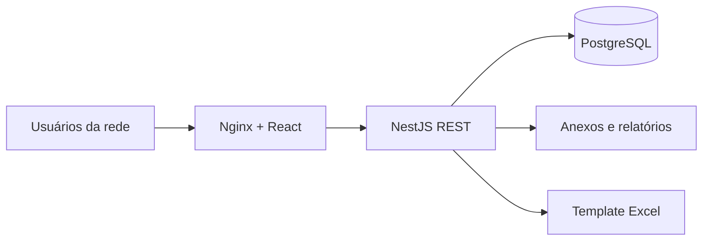

# Gestão de Suprimentos ERM

Sistema interno para substituir a planilha de solicitações de compra por uma fonte transacional, multiusuário e auditável.

## Arquitetura



Monorepo pnpm com `apps/web` (React/Vite/Tailwind/TanStack/React Hook Form/Zod), `apps/api` (NestJS/Prisma/PostgreSQL/Swagger/Pino/ExcelJS) e `packages/shared` (contratos e regras comuns). A modelagem normalizada e o diagnóstico da origem estão em [docs/DIAGNOSTICO_PLANILHA.md](docs/DIAGNOSTICO_PLANILHA.md).

## Início rápido com Docker

1. Copie `.env.example` para `.env`.
2. Troque todas as ocorrências de `CHANGE_ME`.
3. Execute `docker compose up -d --build`.
4. Abra `http://IP_DO_SERVIDOR:8080`. Swagger: `/api/docs`.
5. Crie os dados iniciais: `docker compose exec api pnpm --filter @compras/api db:seed`.

O PostgreSQL não publica porta no host. Os volumes `postgres_data`, `reports`, `attachments` e `backups` são persistentes. Em Windows, autorize o Docker Desktop no firewall privado; em Linux, libere apenas `${APP_PORT}` para a rede interna.

## Execução sem Docker

Requer Node 22 LTS, pnpm 10 e PostgreSQL 17. Configure `.env`, rode `pnpm install`, `pnpm --filter @compras/api db:migrate`, `pnpm --filter @compras/api db:seed` e `pnpm dev`.

## Segurança e perfis

Não há cadastro público. O bootstrap cria ADMIN, COMPRAS, SOLICITANTE e CONSULTA usando `ADMIN_PASSWORD`; todos exigem troca no primeiro acesso. Senhas usam Argon2id. Tokens ficam em cookies HttpOnly/SameSite, sessões são revogáveis e cinco falhas bloqueiam o login por 15 minutos. Autorizações devem ser aplicadas no backend.

## Banco, importação e relatórios

Migração inicial: `pnpm --filter @compras/api db:migrate`. O modelo inclui compras parciais, entregas, histórico de status, estoque e auditoria. A análise repetível da origem é executada com:

```powershell
.\scripts\analyze-workbook.ps1 -InputFile .\templates\SOLICITACAO_DE_COMPRA_ERT_ERM.xlsx -OutputFile .\docs\workbook-analysis.json
```

O relatório consolidado é baixado por `GET /api/reports/consolidated?year=2026`; ele abre uma cópia do template, preserva abas e configura a aba anual, filtro, datas e área de impressão.

## Backup e restauração

No PowerShell, execute `.\scripts\backup\backup.ps1`. O pacote inclui banco, anexos, relatórios, manifesto e verificação SHA-256. Para instalar a rotina diária, use `.\scripts\backup\install-daily-backup.ps1`; para restaurar, use `.\scripts\backup\restore.ps1 -BackupFile .\backups\arquivo.zip`. A restauração substitui dados e deve ser feita em janela de manutenção.

O passo a passo completo está em [Instalação do ERM na rede interna — Windows 10](docs/INSTALACAO_WINDOWS_10_REDE.md). A revisão para alto volume está em [Revisão de desempenho e escalabilidade](docs/REVISAO_ESCALABILIDADE.md).

## Qualidade

```bash
pnpm typecheck
pnpm lint
pnpm test
pnpm build
docker compose config
```

Os testes compartilhados cobrem lead time e datas invertidas. A API usa transações para criar SCs e `version` para retornar 409 em conflito.

## Estrutura

```text
apps/api/              API, Prisma, seed e relatórios
apps/web/              aplicação React
packages/shared/       contratos e regras
templates/             cópia imutável da planilha original
docs/                  diagnóstico e inventário OOXML
scripts/               análise, backup e restauração
reports/ attachments/ backups/
```

## Decisões e limitações

O sistema é um monólito modular offline-first, com `organizationId` para evolução futura. O importador transacional com interface de revisão, telas completas de compras/estoque/auditoria, refresh rotativo e SSE têm a modelagem preparada, mas ainda não estão integralmente expostos na UI atual. Não trate este repositório como homologado para produção sem completar esses fluxos, testes E2E e restauração ensaiada.

## Solução de problemas

- API indisponível: `docker compose ps` e `docker compose logs api`.
- Falha de banco: confira `POSTGRES_*` e `DATABASE_URL`.
- Template ausente: confirme `templates/SOLICITACAO_DE_COMPRA_ERT_ERM.xlsx`.
- Porta ocupada: altere `APP_PORT`.

Uso interno. Consulte [LICENSE](LICENSE) e [CONTRIBUTING.md](CONTRIBUTING.md).

## Controle de estoque

O módulo de estoque possui entradas, saídas, saldo inicial, ajustes auditados, mínimos e alertas. Consulte [o guia do almoxarifado](docs/ESTOQUE.md).

## Fluxo de compras e recebimentos

O módulo **Compras** separa as três etapas operacionais:

1. **Solicitação:** a demanda exibe apenas a quantidade ainda não convertida em pedido.
2. **Pedido:** Compras seleciona os itens solicitados, informa número do pedido, fornecedor, quantidades, preços e previsão.
3. **Recebimento:** o almoxarifado busca pelo número do pedido, informa a Nota Fiscal e confirma as quantidades efetivamente entregues.

O recebimento pode ser parcial. Cada confirmação atualiza, na mesma transação, o saldo pendente do pedido, as quantidades e os status da solicitação, o estoque dos produtos catalogados, o histórico e a auditoria. A mesma Nota Fiscal não pode ser registrada duas vezes no mesmo pedido e quantidades acima dos saldos pendentes são rejeitadas.
